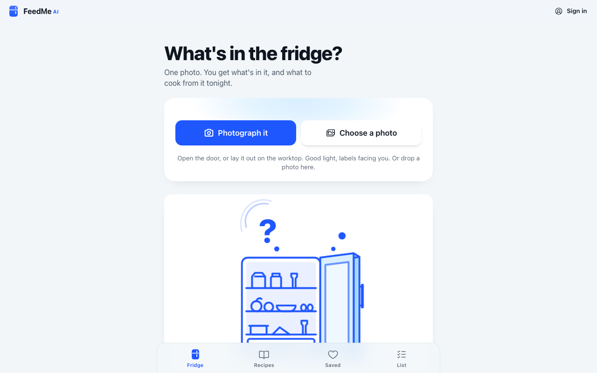
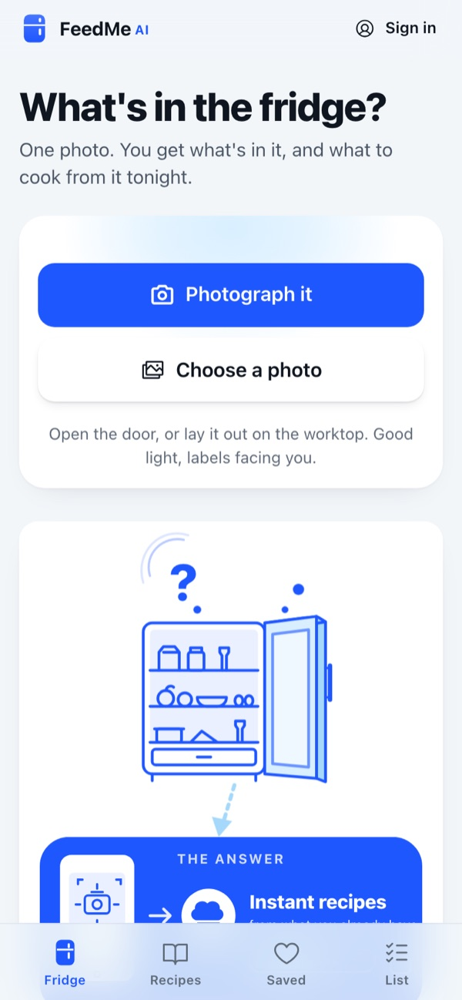
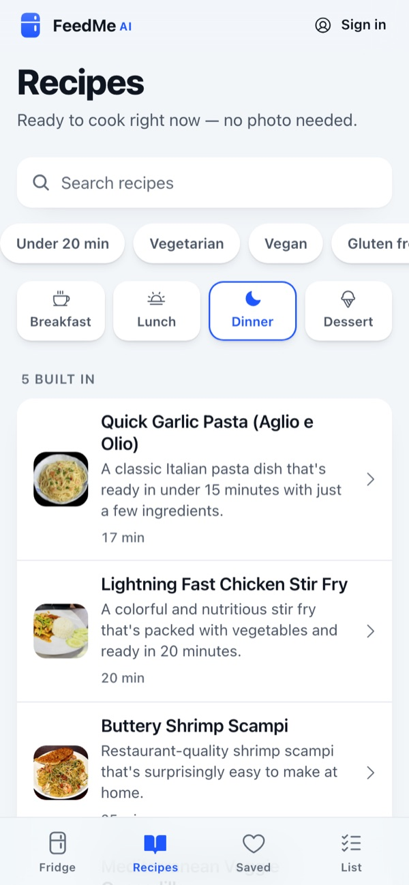
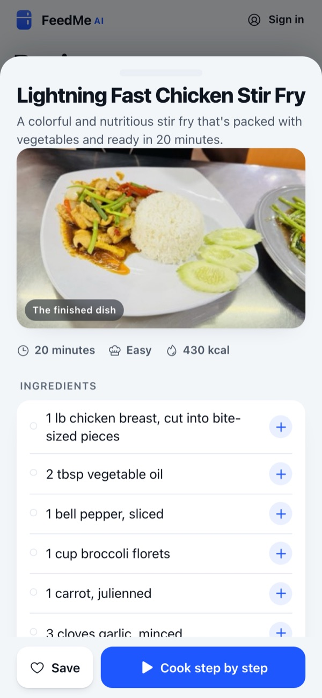

# FeedmeAI

Take one photo of your fridge and get back a list of what's in it and what you could cook from it tonight. A phone-first web app for people who stare into the fridge at 6pm.

**Live: [feedmeai.victorsaly.com](https://feedmeai.victorsaly.com)** (installable as an app from the browser)



<p>
  
  
  
</p>

## What it offers

- **Photo to ingredients.** Take or upload a photo; the app lists what it can see, with rough amounts. The list is editable before you ask for ideas.
- **Dinner ideas from what you have.** A short list of dishes for the meal you pick (breakfast, lunch, dinner or dessert, defaulting to the time of day), sized to how much of each ingredient you have. Open any one for the full recipe.
- **Recipe sheet and cook mode.** Ingredients, method, time, difficulty and an estimated per-serving nutrition figure (calories, protein, carbs, fat). "Cook step by step" shows one step at a time.
- **Real recipes and videos (signed in).** Published recipes from [Spoonacular](https://spoonacular.com/food-api) that use the most of what's in your photo, mixed in with the AI's ideas and credited to their source. Recipes also show a cooking video where one is found.
- **Recipes tab.** Built-in recipes with real photos, a search box and filter chips (time, diet, dish type, cuisine), plus Spoonacular results when signed in.
- **Recent.** Each fridge photo you run, with its list, ideas and opened recipes, is kept on your device and can be reopened without a network call.
- **Saved (signed in).** Save recipes to your account so they follow you between devices. Your fridge photo stays on the device; only the recipe is stored.
- **Shopping list (signed in).** Add missing ingredients from any recipe with one tap, or type your own. Search where to buy an item, or compare shops across the list, for a chosen country.
- **Works offline once installed.** A service worker caches the app so the list still opens in the supermarket.
- **Demo mode.** Without an AI key on the backend, the app still runs: the photo step shows a sample list and ideas come from the built-in recipes, labelled as such.

Sign-in uses the shared victorsaly.com account (Google). Signed out, the photo-to-recipe flow, the Recipes tab and Recent all work; Saved and the shopping list ask you to sign in.

## How it works

- The front end is a static React app on GitHub Pages. It holds no API keys.
- `worker/` is a Cloudflare Worker (`feedmeai-api`) that does everything needing a secret: OpenAI vision and text calls (`gpt-4o-mini`), an optional generated "suggested look" image for new dishes (signed in only), Spoonacular recipe search, YouTube video lookup and Google Shopping search via SearchAPI. AI calls are metered per day, with a higher limit when signed in. It also stores the shopping list in Cloudflare D1.
- `workers/favorites-api/` is a second small Worker that stores saved recipes in the same D1 database, keyed by account.
- Both Workers verify the session token against the shared auth API on each request.

## Tech stack

React 19, TypeScript, Vite, Tailwind CSS, Radix UI / vaul, Cloudflare Workers + D1, OpenAI, Spoonacular, SearchAPI, YouTube Data API.

## Run locally

Requires Node.js 20+.

```bash
git clone https://github.com/victorsaly/feedmeAI.git
cd feedmeAI
npm install
npm run dev        # http://localhost:5173
```

By default the app talks to the deployed Worker, so no `.env` is needed. To point it at your own Worker (for example `npx wrangler dev` in `worker/`), set `VITE_FEEDME_API` in `.env` (see `.env.example`).

Other scripts:

```bash
npm run build      # type build, Vite build, then generate the service worker
npm run preview    # serve the production build on port 4173
npm run lint
npm run type-check
```

### Backend

```bash
cd worker
npx wrangler secret put OPENAI_API_KEY
npx wrangler secret put SPOONACULAR_KEY
npx wrangler secret put SEARCHAPI_KEY
npx wrangler secret put YOUTUBE_API_KEY   # optional
npx wrangler deploy
```

`workers/favorites-api/` deploys the same way with `npx wrangler deploy` from its folder. Each Worker's `wrangler.toml` holds its D1 binding and allowed origins.

Pushing to `main` builds and deploys the front end to GitHub Pages (`.github/workflows/deploy.yml`).

## Project structure

```
src/
  App.tsx              the single page and its stages (start, list, ideas, recipe, cook)
  components/          PhotoPicker, HaulList, IdeaList, IdeaSheet, CookScreen,
                       RecipesTab, SavedList, ListTab, TabBar, SignIn, ...
  lib/
    kitchen.ts         identify -> suggest -> expand, with the offline fallback
    spoonacular.ts     real recipes and videos via the Worker
    history.ts         Recent, kept in localStorage
    favorites.ts       Saved, via favorites-api
    todos.ts           shopping list, via feedmeai-api
    shopping.ts        where-to-buy search and shop comparison
    account.ts         sign-in session
  data/                built-in recipes and search categories
  styles/flow.css      the app's look
worker/                feedmeai-api (AI, recipes, shopping, todos)
workers/favorites-api/ saved recipes
public/                icons, manifest, og image, recipe photos (credits in public/food/CREDITS.md)
```

## License

MIT. See [LICENSE](LICENSE).

Made by [Victor Saly](https://victorsaly.com).
